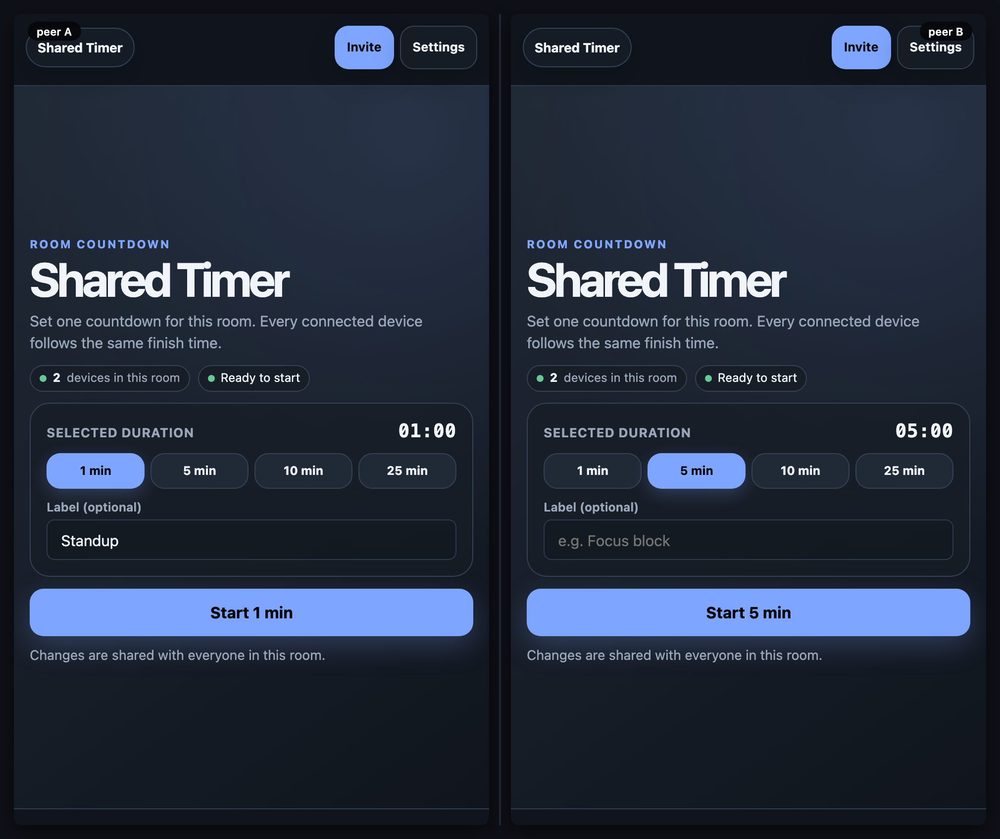

# Shared Timer

[](https://baditaflorin.github.io/mesh-shared-timer/)
[](https://github.com/baditaflorin/mesh-shared-timer/blob/main/package.json)
[](./LICENSE)

> One calm countdown for everyone in the room.

Live: **https://baditaflorin.github.io/mesh-shared-timer/**

Shared Timer is a peer-to-peer room timer. Choose a duration, optionally name
the moment, and start once; every connected device follows the same mesh-clock
deadline, including pause, resume, reset, and the finish signal.

## The experience

The first view is deliberately a small piece of setup, not a kitchen-timer
dashboard: choose a duration, add a helpful label, and use the single primary
action to start it for the room. Once running, the display makes the shared
remaining time and its room status the focus.



The checked-in [`docs/demo.gif`](docs/demo.gif) demonstrates the same room
being started, paused, resumed, and reset across two peers.

## How synchronization works

The timer stores an absolute deadline in a shared Yjs map. Each browser uses
the mesh clock to derive the remaining time locally, so devices converge on
the same end moment rather than broadcasting a fragile stream of ticks. Pause
records one shared remaining value; resume turns it back into a new absolute
deadline. No application server or account is required.

## Quickstart

`mesh-common` must be a sibling directory because this app deliberately uses
it through a local `file:../mesh-common` dependency.

```bash
git clone https://github.com/baditaflorin/mesh-common
git clone https://github.com/baditaflorin/mesh-shared-timer
cd mesh-shared-timer
npm ci
npm run dev
```

## Validation

```bash
npm run fmt:check
npm run typecheck
npm run test:unit
npm run smoke
npx playwright test --workers=1
MESH_RUN_LEAK_TEST=1 MESH_LEAK_DURATION_MS=5000 npx playwright test tests/e2e/memory-leak.spec.ts --workers=1
```

The browser suite includes a real two-peer timer lifecycle and release-layout
contracts for a 390×844 phone viewport and a 1141×602 desktop viewport.

## Self-hosted infrastructure

The browser app uses the shared WebRTC stack below. It has no service of its
own beyond signaling and TURN for peers that cannot connect directly.

| Repo                                              | Endpoint                               | Purpose                                      |
| ------------------------------------------------- | -------------------------------------- | -------------------------------------------- |
| https://github.com/baditaflorin/signaling-server  | `wss://turn.0docker.com/ws`            | y-webrtc signaling fan-out                   |
| https://github.com/baditaflorin/turn-token-server | `https://turn.0docker.com/credentials` | HMAC TURN credentials with a one-hour TTL    |
| https://github.com/baditaflorin/coturn-hetzner    | `turn:turn.0docker.com:3479`           | TURN relay when direct WebRTC is unavailable |

The Settings panel lets a room owner override signaling and TURN endpoints
locally. The relevant localStorage keys are:

- `mesh-shared-timer:signalingUrl`
- `mesh-shared-timer:turnTokenUrl`
- `mesh-shared-timer:iceServers`
- `mesh-shared-timer:room`

## Build and publishing

GitHub Pages serves the committed `docs/` directory from `main`. There is no
GitHub Actions workflow; Pages output is built locally and reviewed before the
pull request is merged.

```bash
npm run smoke
```

See [the privacy note](docs/privacy.md) for the room-level threat model.

## License

[MIT](LICENSE)
